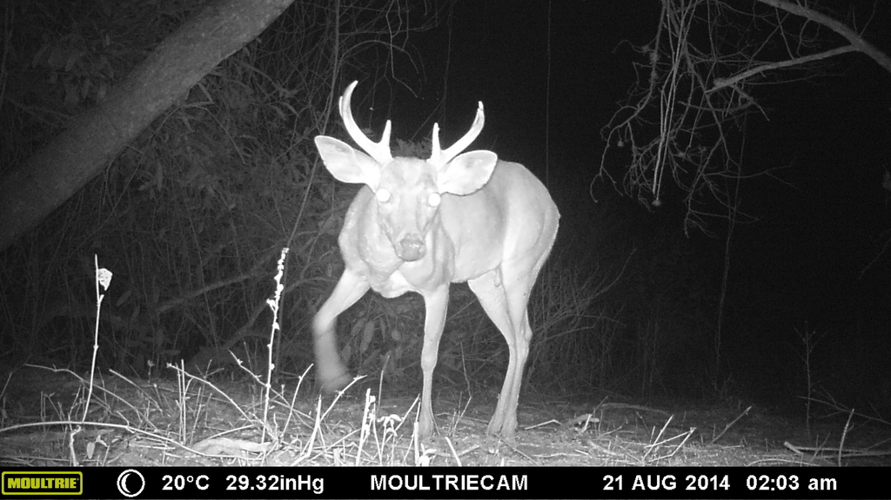

---
output:
  pdf_document: default
  html_document: default
---
# Nuestro ejemplo: {#example}

El set de datos que vamos a simular, imita la forma espacial y temporal como imaginamos se originan las medidas repetidas de presencia ausencia en ecología. Las cuales son una combinación de un proceso ecológico y un proceso de observación. El primer proceso contiene los mecanismos bajo los cuales se originan patrones espacio-temporales de distribución, mientras que el segundo proceso contiene las diferentes facetas en las cuales se originan fuentes de error al tomar los datos.  


Para ser más concretos vamos a llamar a nuestra especie imaginaria con un nombre real. La llamaremos el venado de cola blanca (_Odocoileus virginianus_), un mamífero grande y común, ampliamente distribuido en el continente Americano, y de preocupación menor en términos de [conservación](http://www.iucnredlist.org/details/42394).   



El Venado de cola blanca (_Odocoileus virginianus_) nuestra especie de interes para este ejemplo. Foto del proyecto fauna de Manabi http://faunamanabi.github.io  


El set de datos contiene _J_ datos replicados de detección o no detección de la especie en _M_ sitios, teniendo en cuenta que asumimos que es una población cerrada ('closure' assumption). Es decir que durante el muestreo no ocurrieron cambios por nacimientos, muertes inmigración o emigración.  En otras palabras, el muestreo fue corto en tiempo y la ocurrencia de la especie _z_ no cambió por efectos demográficos.  


Claramente debemos distinguir dos procesos, el primero es el proceso ecológico, el cual genera (parcialmente) un estado latente de la ocurrencia _z_. El segundo es el proceso de observación, el cual produce los datos observados de detección o no detección del venado. Aquí asumimos que el proceso de observación está gobernado por un mecanismo de detección imperfecta. Es decir algunos venados pudieron haberse escapado a mi observación, lo cual genera falsos negativos. También asumimos que los falsos positivos están ausentes, es decir que todo lo que identifico como venado, es efectivamente un venado. Para hacer más realista el ejemplo incluimos los efectos de la altitud y la cobertura de bosque en la ocurrencia, como factores que afectan la ocurrencia linealmente, disminuyéndola para el caso de la elevación y que incrementan la ocupación linealmente para el caso de la cobertura de bosques. Al final las dos variables interactúan negativamente entre sí. Esos efectos se introducen en la ocurrencia en escala logarítmica como tradicionalmente se hace un modelo lineal generalizado (GLM).  


En nuestra simulación vamos a hacer explícito que no es posible detectar a la totalidad de los venados de un sitio de muestreo, así que estamos enfrentando un tipo de error que nos hace sub-estimar la abundancia de la población.  Hay muchas razones por las cuales fallamos en detectar un individuo en la naturaleza, porque nos distrajimos mientras el venado pasó, porque los binoculares no tenían el aumento suficiente, o simplemente porque el venado se escondió detrás de un árbol al sentir nuestro olor, o por alguna otra razón. De esta forma nosotros vamos a registrar la presencia (_z_=1) con una probabilidad de detección _p_ la cual también vamos a hacerla dependiente (en la escala logarítmica) de la altitud y de una co-variable que afecta la detección, la temperatura. En términos generales los animales son más difíciles de observar cuando la temperatura es más alta y por lo general entre más altitud la temperatura disminuye.   De esta forma asumimos que la detección está relacionada negativamente con la altitud y la temperatura. Pero también hay que tener en cuenta que el efecto negativo en _p_ también puede ser mediado por una disminución en la abundancia con la altitud, el cual también causa que la probabilidad de ocupación disminuya con la altitud. Tenga en cuenta que una co-variable, la altitud afecta a ambos procesos, el ecológico (la ocurrencia)  y al proceso de observación (la probabilidad de detección).   Esto tiene un propósito, y es probable que pase en la naturaleza muchas veces. Los modelos de ocupación tienen una base “mecanicista” produciendo variación espacial en la abundancia. Es decir tendremos sitios con mayor abundancia y otros con menor abundancia. Pero los modelos jerárquicos cómo el que estamos por construir, son capaces de desentrañar esas relaciones complejas entre ocurrencia y probabilidad de detección [@Kery2008; @KERY2008; @Kery2012]. Finalmente para este primer ejemplo vamos a dejar por fuera el efecto de la interacción entre la altitud y la temperatura, ajustándolo a cero. Luego podremos variar este parámetro para considerar ese efecto. En resumen vamos a generar datos bajo el siguiente modelo, donde los sitios son indexados cómo _i_ y los conteos repetidos en el sitio van a ser referidos cómo _j_.  


### Modelo Ecológico:

\begin{equation} 
z _{i} = Bernoulli (\psi _{i})
  (\#eq:binom)
\end{equation}

\begin{equation} 
logit(\psi _{i}) = \beta _{0} + \beta _{1} \ast Altitud _{i} + \beta _{2}\ast CovBosque _{i} + \beta _{3} \ast Altitud _{i} \ast CovBosque _{i}
  (\#eq:binom)
\end{equation}


### Modelo de Observación:

\begin{equation} 
y _{ij} = Bernoulli (z _{i} * p _{ij})
  (\#eq:binom)
\end{equation}

\begin{equation} 
logit(p _{ij}) = \alpha  _{0} + \alpha  _{1} \ast Altitud _{i} + \alpha  _{2}\ast Temperatura _{ij} + \alpha _{3} \ast Altitud _{i} \ast Temperatura _{ij}
  (\#eq:binom)
\end{equation}

Donde $\psi$ es la ocupación y _p_ la probabilidad de detección. Con $\beta$ como el coeficiente de la regresión para las co-variables de la ocupación y  $\alpha$ el coeficiente de regresión para las co-variables de la detección.    


Vamos a generar datos desde “dentro hacia afuera” y desde arriba hacia abajo. Para esto, primero escogemos el tamaño de la muestra y creamos los valores para las co-variables. Segundo, seleccionamos los valores de los parámetros del modelo ecológico (la ocupación) y ensamblamos la ocurrencia esperada (el parámetro  $\psi$, ocupación) y posteriormente obtenemos la variable al azar _z_ la cual tiene distribución Bernoulli.  Tercero, seleccionamos los valores de los parámetros del modelo de observación (la detección), para ensamblar la probabilidad de detección _p_ y obtener el segundo set de una variable al azar _y_ (detección observada o no observada de un venado) la cual también tiene distribución Bernoulli. 


Para simular los datos usaremos el lenguaje de programación estadística R [@RCoreTeam2016], el cual provee una gran variedad de técnicas gráficas y estadísticas de modelación y un gran ecosistema de paquetes para análisis estadístico y ecológico. Si aún no lo ha hecho, baje e instale [R](http://www.r-project.org/) en su computadora, posteriormente haga lo mismo con [RStudio.](http://www.rstudio.com/)  


## Pasos iniciales: tamaño de la muestra y valores de las co-variables

Inicie [RStudio](http://www.rstudio.com/), copie, pegue y ejecute los comandos de la ventana gris.  

Primero escogemos el  tamaño de la muestra, el número de sitios y el número de medidas repetidas (número de visitas) de presencia/ausencia en cada sitio.


```{r primer,cache=TRUE}
M <- 60  # Número de réplicas espaciales (sitios)
J <- 30  # Número de réplicas temporales (conteos repetidos)
```


Luego creamos los valores para las co-variables. Tenemos altitud y cobertura de bosque como co-variables de cada sitio. Ellas difieren de sitio a sitio pero para cada muestreo son las mismas. Mientras que la temperatura es una co-variable de la observación, así que si varía en cada muestreo y también en cada sitio. Recuerde que el sub índice _i_ se refiere al sitio y el _j_ a cada muestreo. Para simplificar las cosas nuestras co-variables van a tener una distribución normal con una media centrada en cero y no se van a extender muy lejos en cada lado del cero. En análisis de datos reales tendremos que estandarizar las co-variables  para evitar problemas numéricos de diferencia en las escalas de las co-variables y poder calcular el valor de máxima verosimilitud (ML), así como también para obtener convergencia en las cadenas de Markov del modelo Bayesiano. Aquí vamos a ignorar un hecho de la vida real, y es que las co-variables no son totalmente independientes la una de la otra, es decir en la naturaleza la cobertura boscosa puede estar relacionada con la altitud, pero esto no va a ser relevante, por ahora.  


Para inicializar el generador de números aleatorios y obtener siempre los mismos resultados podemos adicionar la siguiente línea:   


```{r seed1, echo=TRUE,cache=TRUE,warning=FALSE}
set.seed(24) # Can choose seed of your choice
```

De esta forma podremos obtener siempre los mismos estimados. Pero luego cuando queramos obtener el error de muestreo deberemos remover esa línea. Para este ejemplo generaremos valores para las covariables centrados en cero y variando de -1 a 1. 


```{r covs1, echo=TRUE,cache=TRUE}
elev <- runif(n = M, -1, 1)             # Scaled elevation of a site
forest <- runif(n = M, -1, 1)           # Scaled forest cover at each site
temp <- array(runif(n = M*J, -1, 1), dim = c(M, J)) # Scaled temperature
```

## Simulando el proceso ecológico y su resultado: la ocurrencia del venado 

Para simular la ocurrencia del venado en cada sitio, escogemos los valores para los parámetros que gobiernan la variación espacial en la ocurrencia $\beta _{0}$ a $\beta _{3}$. El primer parámetro es la ocurrencia promedio esperada del venado (probabilidad de ocupación) cuando todas las co-variables tienen un valor de cero, en otras palabras el intercepto del modelo de ocurrencia.  Preferimos pensar en los venados en términos de su ocurrencia en lugar de logit (ocurrencia).  Aquí nosotros escogemos el intercepto de la ocupación primero y luego lo transformamos de la escala logarítmica con la función de enlace logit. 

```{r psi_effect1, echo=TRUE,cache=TRUE}
mean.occupancy <- 0.60         # Mean expected occurrence of deer
beta0 <- plogis(mean.occupancy) # Same on logit scale (= logit-scale intercept)
beta1 <- -2                    # Effect (slope) of elevation
beta2 <- 2                     # Effect (slope) of forest cover
beta3 <- 1                     # Interaction effect (slope) of elev and forest
```

Aquí aplicamos el modelo lineal (a la escala logarítmica) y obtenemos la transformación logit de la probabilidad de ocupación, la cual invertimos con la transformación logit para obtener la ocupación del venado y graficar todo.  

```{r fig2, echo=TRUE, cache=TRUE, fig.cap="Dos formas de mostrar la relación entre la probabilidad de ocurrencia de los venados y las co-variables.  (A) Relación entre psi y altitud para un valor constante (media igual a cero) de cobertura boscosa. (B) Relación entre psi y la altitud en un valor observado de cobertura boscosa. (C) relación psi cobertura boscosa para una altitud constante (en la media de cero). (D) Relación psi cobertura boscosa para el valor observado de altitud.", warning=FALSE, fig.show='asis'}
logit.psi <- beta0 + beta1 * elev + beta2 * forest + beta3 * elev * forest
psi <- plogis(logit.psi)      # Inverse link transformation

# par()              # view current settings
opar <- par()      # make a copy of current settings
par(mfrow = c(2, 2), mar = c(5,4,2,2), cex.main = 1)
curve(plogis(beta0 + beta1*x), -1, 1, col = "red", frame.plot = FALSE, ylim = c(0, 1),
      xlab = "Altitud", ylab = "psi", lwd = 2)
text(0.9, 0.95, "A", cex = 1.5)
plot(elev, psi, frame.plot = FALSE, ylim = c(0, 1), xlab = "Altitud", ylab = "")
text(0.9, 0.95, "B", cex = 1.5)
curve(plogis(beta0 + beta2*x), -1, 1, col = "red", frame.plot = FALSE, ylim = c(0, 1), 
      xlab = "Forest cover", ylab = "psi", lwd = 2)
text(-0.9, 0.95, "C", cex = 1.5)
plot(forest, psi, frame.plot = FALSE, ylim = c(0, 1), xlab = "Forest cover", ylab = "")
text(-0.9, 0.95, "D", cex = 1.5)
# dev.off()
par(opar)          # restore original par settings
```


Para mostrar mejor la relación conjunta entre las dos covariables y psi, debemos realizar un diagrama de superficie. Aquí no hemos cambiado nada de la simulación, solo le hemos agregado más datos para visualizar mejor.  

```{r fig3, cache=TRUE, fig.cap="Relación construida ente los datos simulados de la ocurrencia esperada (ocupación) del venado (psi) representada con la escala de color de gris a rojo, contra la altitud y la cobertura boscosa simultáneamente. En este caso la interacción entre las dos covariables está dada por el valor de beta3 = 1 que hemos establecido anteriormente.", fig.scap="fig3", warning=FALSE, fig.show='asis'}
# Compute expected occurrence for a grid of elevation and forest cover
cov1 <- seq(-1, 1, , 100)                       # Values for elevation
cov2 <- seq(-1, 1, , 100)                       # Values for forest cover
psi.matrix <- array(NA, dim = c(100, 100))      # Prediction matrix, for every 
# combination of values of elevation and forest cover

for(i in 1:100){
   for(j in 1:100){
      psi.matrix[i, j] <- plogis(beta0 + 
                                   beta1 * cov1[i] + 
                                   beta2 * cov2[j] + 
                                   beta3 * cov1[i] * cov2[j] )
   }
}

mapPalette <- colorRampPalette(c("grey", "yellow", "orange", "red"))
image(x = cov1, y = cov2, z = psi.matrix, col = mapPalette(100), xlab = "Altitud", 
      ylab = "Forest cover", cex.lab = 1.2)
contour(x = cov1, y = cov2, z = psi.matrix, add = TRUE, lwd = 1)
matpoints(elev, forest, pch="+", cex=0.8)


```


Hasta ahora no hemos introducido ninguna variación estocástica en la relación entre la ocurrencia del venado y las covariables. Para hacer esto debemos hacer uso de algunos modelos estadísticos o distribuciones estadísticas, para describir la variabilidad al azar alrededor del valor esperado de psi. La forma típica de introducir esta variación al azar es obtener la ocurrencia de venados en cada sitio _i_, $z _{i}$, de una distribución Bernoulli con los valores esperados ($\psi _{i}$).   

### Por qué Bernoulli?

En el proceso ecológico $z _{i}$ la ocurrencia del venado esta representado por una distribución de tipo Bernoulli donde el venado esté presente en un sitio representado como la ocupación $\psi$ en un sitio en que esta presente, o no esta presente  1-$\psi$. La distribución Bernoulli es un caso especial de la distribución binomial, y su mejor ejemplo es el lanzamiento de una moneda una sola vez. Si requiere una explicación más extensa, básica, detallada y con más ejemplos le recomiendo visitar [khanacademy.](https://es.khanacademy.org/math/probability/statistics-inferential/margin-of-error/v/mean-and-variance-of-bernoulli-distribution-example) 


```{r expect, cache=TRUE, warning=FALSE}
z <- rbinom(n = M, size = 1, prob = psi)  # Realised occurrence. A Bernoulli
sum(z)                                    # Total number of occupied sites
table(z)                                  # Frequency distribution of deer occurrence
```

Aquí hemos creado el resultado del proceso ecológico: ocurrencia específica para cada sitio $z _{1}$. Vemos que 20 sitios no están ocupados y que los restantes 40 si están ocupados. 


## Simulando el proceso de observación y su resultado: la detección


La ocurrencia _z_ no es lo que normalmente vemos, ya que hay un chance de que fallemos en observar un individuo. De ahí que haya una medida binaria de error cuando medimos la ocurrencia (lo observamos o no lo observamos). Nosotros asumimos que podemos hacer únicamente una de las dos posibles observaciones (si, no), pero pudimos haber perdido la observación de un venado en algún sitio, entonces la probabilidad de detección es menor que uno y la medida de error es afectada por la cobertura de bosque y la temperatura. Hay que tener en cuenta que nunca vamos a registrar la presencia de un venado cuando en realidad no hay venados. En otras palabras estamos asumiendo que no tenemos falsos positivos. Para hacer explícito que tenemos un efecto de interacción entre dos co-variables en nuestros datos, vamos a permitir un efecto de la interacción en el código, pero ajustado a cero y de esta forma sin efecto en el modelo que genera los datos.  Primero seleccionamos los valores para $\alpha _{0}$ hasta $\alpha _{3}$, donde el primero es la probabilidad de detección para el venado, en la escala logit, cuando todas las co-variables de la detección tienen un valor de cero.  Hemos escogido el intercepto del modelo de detección y luego lo transformamos con la función de enlace plogis. Esto no es lo mismo que la probabilidad de detección media, la cual es más alta en nuestro modelo de simulación, como veremos más adelante. 


```{r p_effec, cache=TRUE, warning=FALSE}
mean.detection <- 0.3            # Mean expected detection
alpha0 <- qlogis(mean.detection) # same on logit scale (intercept)
alpha1 <- -1                     # Effect (slope) of elevation
alpha2 <- -3                     # Effect (slope) of temperature
alpha3 <- 0                      # Interaction effect (slope) of elevevation and temperature
```

Aplicando el modelo lineal, tenemos el logit de la probabilidad de detección del venado para cada sitio y muestreo, y aplicándole la transformación inversa (plogis), obtenemos una matriz de las dimensiones 60 por 30 con la probabilidad de detección para cada sitio _i_ y muestreo _j_. Finalmente, graficamos las relaciones para la probabilidad de detección en los datos.   


```{r fig4, cache=TRUE, warning=FALSE, fig.cap="Dos formas de mostrar las relaciones entre la probabilidad de detección esperada del venado (_p_) y las dos variables altitud y temperatura. (A) Relación _p_ y altitud para temperatura constante (en el valor medio, que es igual a cero). (B) Relación entre _p_ y la altitud en el valor observado de cantidad de temperatura. (C) Relación entre _p_ y temperatura para un valor constante de altitud (en la altitud media igual a cero). (D) Relación entre _p_ y temperatura para un valor observado de altitud.", fig.scap="fig4", warning=FALSE, fig.show='asis'}

logit.p <- alpha0 + alpha1 * elev + alpha2 * temp + alpha3 * elev * temp
p <- plogis(logit.p)             # Inverse link transform 
mean(p)                          # average per-site p is about 0.39

par(mfrow = c(2, 2), mar = c(5,4,2,2), cex.main = 1)
curve(plogis(alpha0 + alpha1*x), -1, 1, col = "red", frame.plot = FALSE, ylim = c(0, 1.1), 
      xlab = "Altitud", ylab = "p", lwd = 2)
text(-0.9, 1.05, "A", cex = 1.5)
matplot(elev, p, pch = "*", frame.plot = FALSE, ylim = c(0, 1.1), xlab = "Altitud", 
        ylab = "")
text(-0.9, 1.05, "B", cex = 1.5)
curve(plogis(alpha0 + alpha2*x), -1, 1, col = "red", frame.plot = FALSE, ylim = c(0, 1.1), 
      xlab = "Temperature", ylab = "p", lwd = 2)
text(-0.9, 1.05, "C", cex = 1.5)
matplot(temp, p, pch = "*", frame.plot = FALSE, ylim = c(0, 1.1), xlab = "Temperature", 
        ylab = "p")
text(-0.9, 1.05, "D", cex = 1.5)

```


De forma similar vamos a producir una gráfica de una superficie con la relación conjunta entre la altitud, la temperatura y la probabilidad de detección del venado (_p_), actuando simultáneamente. La relación en la escala logarítmica es representada por un plano con pendiente que representa la interacción entre la elevación y la cobertura de bosque. 

```{r fig5, cache=TRUE, fig.cap="Relación construida ente los datos simulados de la probabilidad de detección esperada (detectabilidad) del venado (p) representada con la escala de color de gris a rojo, contra la altitud y la temperatura simultáneamente. En este caso la interacción entre las dos covariables tiene una relación lineal que esta dada por el valor de alpha3 = 0 que hemos establecido anteriormente.", fig.scap="fig5", warning=FALSE, fig.show='asis'}
# Compute expected detection probability for a grid of elevation and temperature
cov1 <- seq(-1, 1,,100)                  # Values of elevation
cov2 <- seq(-1,1,,100)                   # Values of temperature
p.matrix <- array(NA, dim = c(100, 100)) # Prediction matrix which combines 
# every value in cov 1 with every other in cov2
for(i in 1:100){
   for(j in 1:100){
      p.matrix[i, j] <- plogis(alpha0 + alpha1 * cov1[i] + 
                                 alpha2 * cov2[j] + 
                                 alpha3 * cov1[i] * cov2[j])
   }
}
image(x = cov1, y = cov2, z = p.matrix, col = mapPalette(100), xlab = "Altitud", 
      ylab = "Temperature", cex.lab = 1.2)
contour(x = cov1, y = cov2, z = p.matrix, add = TRUE, lwd = 1)
matpoints(elev, temp, pch="+", cex=0.7, col = "black")

```

Hasta acá hemos modelado los dos procesos el ecológico $z$ y el de observación _p_ por aparte. Ahora tendremos que ponerlos juntos, y para esto multiplicamos el resultado del proceso ecológico por la probabilidad de detección dentro de una distribución Bernoulli.

### Uniendo los dos procesos el ecológico y el de observación

Cuando “medimos” la ocurrencia, la detección imperfecta, representa una fuente de error con una distribución de tipo Bernoulli (por ejemplo la presencia del venado en un sitio en que es detectado con una probabilidad _p_, o no es detectado como  1-_p_). Al aplicar este proceso de observación producimos medidas repetidas de la presencia o ausencia (1 o 0) del venado en cada sitio. Recuerde que la distribución Bernoulli es un caso especial de la distribución binomial, y su mejor ejemplo es el lanzamiento de una moneda una sola vez.  


En este momento estamos estableciendo la jerarquía en el modelo jerárquico. Aca estamos anidando el proceso ecológico "dentro" del proceso de observación.   

```{r Bernoull, cache=TRUE, warning=FALSE}
y <- matrix(NA, nrow = M, ncol = J)      # Prepare array for counts
for (i in 1:J){                          # Generate counts
   y[,i] <- rbinom(n = M, size = 1, prob = z*p[,i])   # this is the Bernoulli
}

```

Hasta acá hemos simulado la presencia/ausencia del venado de cola blanca en 60 sitios durante 30 sesiones de muestreo. Veamos que contienen las tablas. Recuerde que los sitios están en las filas y los muestreos repetidos en las columnas. Para comparar, mostraremos la verdadera ocurrencia en la primera columna para 30 sitios y solo cinco muestreos.

```{r tabla1, echo =TRUE, results = 'asis',warning=FALSE}
library(knitr)
kable(as.data.frame(head(cbind("True Presence/Absence" = z, 
           "1st survey" = y[,1], 
           "2nd survey" = y[,2], 
           "3rd survey" = y[,3],
           "4th survey" = y[,4],
           "5th survey" = y[,5]), 30)) )   # First 30 rows (= sites)

```

Ahora finalmente visualizaremos gráficamente los datos de unos y ceros que hemos simulado para nuestro muestreo. Recuerde que se trata de valores de unos que representan si hemos detectado, o no hemos detectado al venado, en cada uno de los sitios de muestreo en cada una de las visitas.   

```{r fig6, cache=TRUE, fig.cap="Relación entre la ocupación observada (jittered) de venados (y) y las tres covariables estandarizadas. Altitud (A). Cobertura de bosque (B). Temperatura (C) y la frecuencia de distribución de la ocurrencia observada (y) en un set de datos de 60 sitios con 30 muestreos cada uno (D).", fig.scap="fig6", warning=FALSE, fig.show='asis'}

par(mfrow = c(2, 2), mar = c(5,4,2,2), cex.main = 1)
matplot(elev, jitter(y), pch = "*", frame.plot = FALSE, ylim = c(0, 1), 
        xlab = "Altitud", ylab = "Detection/Nondetection (y)")
matplot(forest, jitter(y), pch = "*", frame.plot = FALSE, ylim = c(0, 1), 
        xlab = "Forest cover", ylab = "Detection/Nondetection (y)")
matplot(temp, jitter(y), pch = "*", frame.plot = FALSE, ylim = c(0, 1), 
        xlab = "Temperature", ylab = "Detection/Nondetection (y)")
hist(y, breaks = 50, col = "grey", ylim = c(0, 600), main = "", 
     xlab = "Detection/Nondetection (y)")

```


Hasta aquí hemos creado un set de datos donde la detección/no detección del venado esta negativamente correlacionado con la temperatura y positivamente relacionado con la cobertura de bosque. Hay una razón por la cual esta correlación entre variables es diferente. La ocurrencia por sitio, el objetivo de la inferencia ecológica, está afectado por la cobertura de bosque y la altitud, pero no por la temperatura, mientras que la probabilidad de detección, el parámetro caracterizando la medida del proceso de error cuando tomamos medidas de ocurrencia, es también afectado por la altitud y adicionalmente por la temperatura. Por lo tanto, como se puede notar, hay un gran reto para poder desenredar la razón de la variación espacio-temporal en la observación de los datos de detección/no detección, dado que pueden ser afectados por dos procesos totalmente diferentes: el ecológico y el observacional, que también la misma covariable puede afectar los dos procesos y que también pueden existir interacciones entre covariables.  


